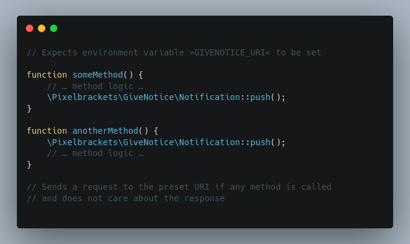

# Give Notice


[](https://packagist.org/packages/pixelbrackets/give-notice/)
[](https://gitlab.com/pixelbrackets/give-notice/pipelines)
[](https://gitlab.com/pixelbrackets/give-notice#requirements)
[](https://spdx.org/licenses/GPL-2.0-or-later.html)
[](https://gitlab.com/pixelbrackets/give-notice/-/blob/master/CONTRIBUTING.md)

Send a request to a preset URI and don’t expect a response.



## Vision

The idea of the package is to just “give notice” to another service. When the
notification is send, it is not relevant to get any feedback.

This package provides a static method to sends requests to a preset URI.

The URI is configured with an environment variable and therefore separated
from application code.

The app calling the method does not need or want a response.

The method is silent. The request timeout of the method is very low by default.

Use cases:
- Send a heartbeat to another service, to 
  [push instead of polling](https://resthooks.org/), but yet don't reverse
  responsibilities to react to unavailability
- Ping a tracking service whenever a certain API endpoint was called,
  [limit the timeout and discard any response](https://stackoverflow.com/questions/14359926/send-http-request-from-php-without-waiting-for-response),
  because under heavy load it is more important to keep a fast API than 
  loosing some tracking requests
- Notify an unimportant service or be absolutely positive the message will
  receive its target and do not block the app unnecessarily

See [»Usage«](#usage) for an example.

The package follows the KISS principle.

## Requirements

- PHP

## Installation

Packagist Entry https://packagist.org/packages/pixelbrackets/give-notice/

## Source

https://gitlab.com/pixelbrackets/give-notice/

Mirror https://github.com/pixelbrackets/give-notice/

## Usage

Set an environment variable to preset a URI to call later on
   ```bash
   GIVENOTICE_URL='https://example.com/endpoint/11azqde1'
   ```

1. Send a request straightaway
   ```php
   \Pixelbrackets\GiveNotice\Notification::push();
   ```

☝️ Be aware that the static notification object is silent by design. It returns
nothing and catches exceptions, such as connection errors. If the notified 
service is not available then your app will not hear about it. Instead, 
the service needs to monitor and react to overdue messages.

## License

GNU General Public License version 2 or later

The GNU General Public License can be found at http://www.gnu.org/copyleft/gpl.html.

## Author

Dan Untenzu (<mail@pixelbrackets.de> / [@pixelbrackets](https://pixelbrackets.de))

## Changelog

See [./CHANGELOG.md](CHANGELOG.md)

## Contribution

This script is Open Source, so please use, patch, extend or fork it.

[Contributions](CONTRIBUTING.md) are welcome!
